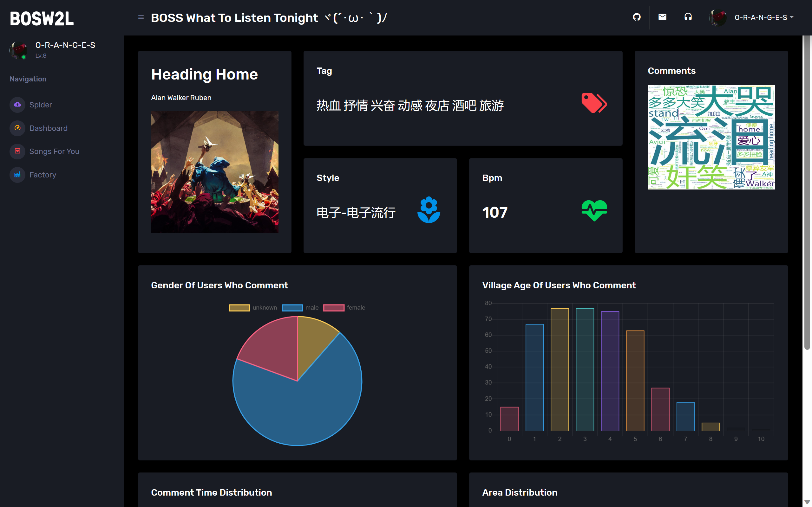
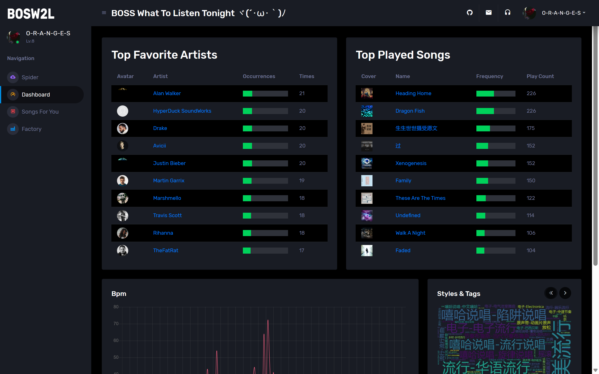
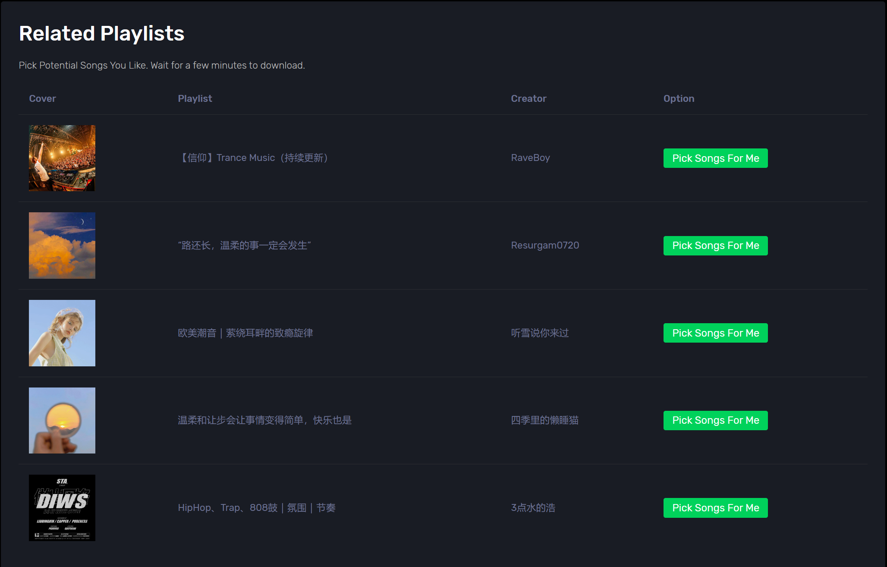
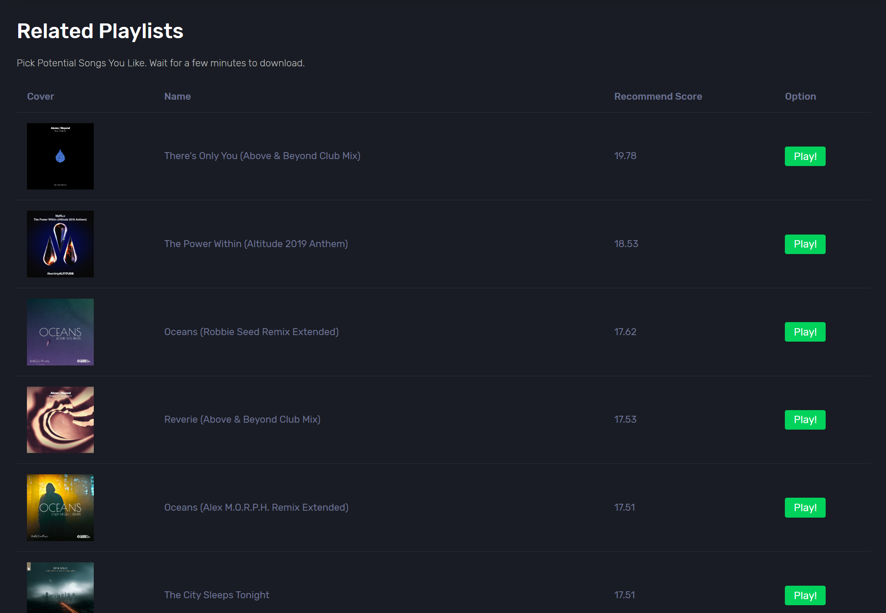

# BOSS What To Listen Tonight

BOSW2T(BOSS What To Listen Tonight) is a personal songs data analysis programme on NeteaseCloudMusic platform. It provides following features based on your history song data:

- About User's History
  - Your favourite artists.
  - Top played songs.
  - Statistics of songs Bpm.
  - Style and Tags statistics of favored songs.
  - Which language of songs you preferred.
- About User's Preference
  - Playlist recommendation
  - Pick songs from specific playlist through collaborative filtering recommendation algorithm.
- About Songs
  - Tags, Style, Bpm and artist of a song.
  - Wordcloud of comments relative to the song.
  - Gender distribution of commenters.
  - Village age distribution of commenters.
  - Comment time distribution during one day.
  - The rank of commenters' location.

## Quick Start

### Environment

- Python 3.8
- NodeJS 12+

### Install Dependencies

`cd app/musicPlatform/NeteaseCloudMusicAPi`

`npm install`

`cd ../../..`

`python -m venv venv`

`venv/Scripts/activate`

`pip install -r requirements`

### Run

`venv/Scripts/activate`

`python main.py production`

## Credit

- [NeteaseCloudMusicApi](https://github.com/Binaryify/NeteaseCloudMusicApi) 网易云音乐api

- [网页模板参考](https://sc.chinaz.com/moban/220905178720.htm#down)