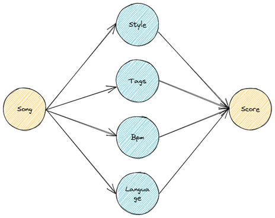

# Project Report

## Project Description

This project is a Netease Cloud Music song preference analysis program that can crawl the song list, songs and comments created and collected by users in the Netease Cloud Music software in real time, and perform visual data analysis on users’ song preferences. This project includes the following features:

- About User's History
    - Your favourite artists.
    - Top played songs.
    - Statistics of songs Bpm.
    - Style and Tags statistics of favored songs.
    - Which language of songs you preferred.
- About User's Preference
    - Playlist recommendation
    - Pick songs from specific playlist through collaborative filtering recommendation algorithm.
- About Songs
    - Tags, Style, Bpm and artist of a song.
    - Wordcloud of comments relative to the song.
    - Gender distribution of commenters.
    - Village age distribution of commenters.
    - Comment time distribution during one day.
    - The rank of commenters' location.


## Structural Plan

### System Structure

 

### System Flow

 


## Algorithmic Plan

### Statistics Module

The data module includes the following parts: user data crawling, data processing, data analysis and visualization.

#### User data crawling

The project use NeteaseCloudMusicApi to crawl user information and song data. Since the original NeteaseCloudMusicApi project is based on the NodeJS platform, its API needs to be encapsulated. In the project, a package named musicPlatform is created, and a class named NeteaseCloudMusicProxy is created to implement the data crawling function. The musicPlatform.\_\_init\_\_.py file declares a factory function for instantiating an API proxy object.

```python
# __init__.py
from .neteaseCloudMusicApi import NeteaseCloudMusicProxy

def create_app():
    ncp = NeteaseCloudMusicProxy()
    return ncp
```

After instantiating the NeteaseCloudMusicProxy object, apply run() method to start the API proxy. After that, the member function sends an HTTP request to the specified port and receives the returned JSON data. The JSON is then parsed and the required data is extracted and returned.

```Python
# neteaseCloudMusicApi.py
class NeteaseCloudMusicProxy:
    @staticmethod
    def run():
        command = r"node app/musicPlatform/NeteaseCloudMusicApi/app.js"
        subprocess.Popen(command, shell=True, close_fds=False)
    
    def api_get(self, api_url: str, root_url: str = "http://localhost:3000"):
        """
        发送调用api接口请求
        """
        pass
    
    def get_user_detail(self, uid):
        """
        获取用户信息
        :param uid:用户uid
        """
        pass
    ...
```

#### Data processing and analysis

A module called statistic.py was created in the project to process the crawled data. The crawled data is cleaned and structured and stored in a pickle file. 

```python
# statistic.py
def save_song_info(song_id, song_info):
    """
    保存pickle格式的音乐信息
    """
    song_path = f"local/songs/{song_id}.pickle"
    fileio.dump_pickle(song_info, song_path)
```

In particular, in order to improve the code reuse rate, a fileio module was created for file read and write operations.

```python
# fileio.py
def load_pickle(path):
    with open(path, "rb") as f:
        data = pickle.load(f)
    return data


def dump_pickle(data, path):
    with open(path, 'wb') as f:
        pickle.dump(data, f)
```

#### Data visualization

The project use the external module `wordcloud` to generate a word cloud. Count the number of occurrences of data entries, save them in a specified format and generate a word cloud. 


The statistical chart is rendered using web js, the rendering code uses website templates, and the data is processed using Python.


### Web application

The project uses the Flask web framework to build the user interaction interface. Due to the large number of pages and multiple modules, the factory pattern is used to build application examples for maintenance and testing. In the project, an app package is created, and its \_\_init\_\_.py under the directory is the Flask app factory function, which is responsible for configuring and registering blueprints for the Flask application. The Flask application factory configuration is in the config.py module, where a Config class is defined. Three classes DevelopmentConfig, TestingConfig, and ProductionConfig inherit from the Config class for configuration under different usage scenarios.

```python
# __init__.py
from flask import Flask
from .config import config

def create_app(config_name='default'):
    app = Flask(__name__)
    app.config.from_object(config[config_name])

    from .main import main as main_blueprint
    app.register_blueprint(main_blueprint)

    return app
```

When running the project, different configurations can be used by adding different command-line parameters. For example, `python main.py debug`.

```python
# config.py
import os
basedir = os.path.abspath(os.path.dirname(__file__))

class Config:
    SECRET_KEY = os.environ.get('SECRET_KEY') or 'dev'

    @staticmethod
    def init_app(app):
        pass

class DevelopmentConfig(Config):
    DEBUG = True

class TestingConfig(Config):
    TESTING = True

class ProductionConfig(Config):
    pass

config = {
    'debug': DevelopmentConfig,
    'testing': TestingConfig,
    'production': ProductionConfig,
    'default': DevelopmentConfig
}
```

### Playlist recommendation and song selection

The playlist recommendation uses the playlist recommendation API of the Netease Cloud Music platform. It takes the user’s favorite playlist as input and returns related recommended playlists. Since not every song in the recommended playlists of the music platform is suitable for personal preferences, I designed a song-based collaborative filtering algorithm based on user listening preferences. It can score the recommendation degree of each song in the playlist and select songs that users may like based on the recommendation score to improve their listening experience.

The following introduces the song-based collaborative filtering algorithm used in the application. After crawling the user’s favorite song data, the song’s style tags, language, and bpm are counted. The weight is set according to the proportion of the number of occurrences of each tag. The recommendation degree of a single song is the weighted sum of its own tags.



## Module List

- Flask
- wordcloud
- NeteaseCloudMusicApi


